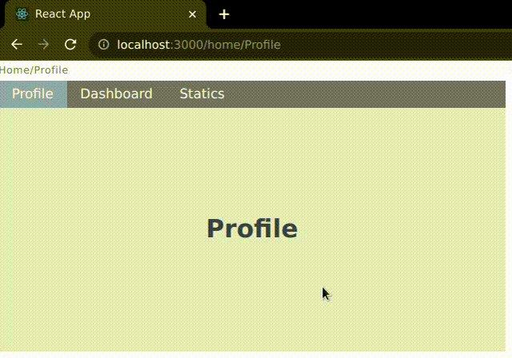

# Nested Routes React

This module will help you to implement the nested routes easily. it will give you a component `NestedRoutes` and a hook useActivePath where NestedRoutes will be used to wrap the required document which you want to show on the screen, and hook will be used to check which path is active actually and accordingly you can perform your operation.

This module will work only with the following versions:

```json
    "react-router": "^6.0.2",
    "react": "^17.0.2"
```

## Example

```jsx
// App.js
import "./App.css";
import { BrowserRouter, Routes, Route, Navigate } from "react-router-dom";
import Home from "./components/Home";

function App() {
  return (
    <BrowserRouter>
      <Routes>
        <Route path="/home/:tab" element={<Home />} />
        <Route path="/home" element={<Home />} />

        <Route path="*" element={<Navigate replace to="/home" />} />
      </Routes>
    </BrowserRouter>
  );
}

export default App;
```

```jsx
// ./components/Home.jsx
import React from "react";
import Tab from "./Tab";
import { Link } from "react-router-dom";
import NestedRoute, { useActivePath } from "react-nested-routes";
import classNames from "classnames";

const Home = () => {
  const activePath = useActivePath({ parent: "home" });

  return (
    <div className="flex">
      <div className="flex flex-col p-2n w-1/2">
        <div className="text-xs py-1 text-gray-500 tracking-wider">
          Home/{activePath}
        </div>
        <div className="flex bg-gray-500 text-white">
          {["Profile", "Dashboard", "Statics"].map((item) => {
            return (
              <Link
                to={`/home/${item}`}
                className={classNames("block p-1 px-4", {
                  "bg-gray-400": activePath === item,
                })}
              >
                {item}
              </Link>
            );
          })}
        </div>
        {["Profile", "Dashboard", "Statics"].map((item) => {
          return (
            <NestedRoute path={item} parent="home">
              <Tab tab={item} />
            </NestedRoute>
          );
        })}{" "}
      </div>
    </div>
  );
};

export default Home;
```

```jsx
// ./components/Tab.jsx
import React from "react";

const Tab = (props) => {
  const { tab } = props;
  return (
    <div className="flex flex-col items-center p-10 py-32 justify-between w-full font-bold bg-gray-200">
      <div className="text-gray-700 text-3xl">{tab}</div>
    </div>
  );
};

export default Tab;
```

### Output


